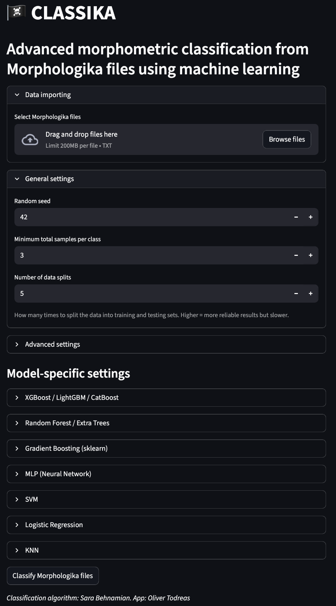
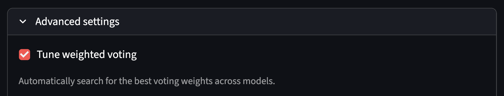
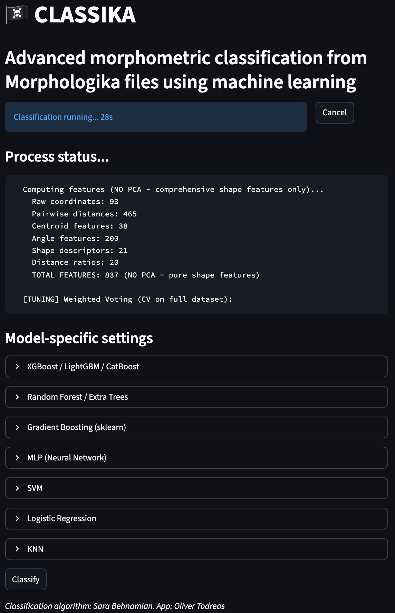
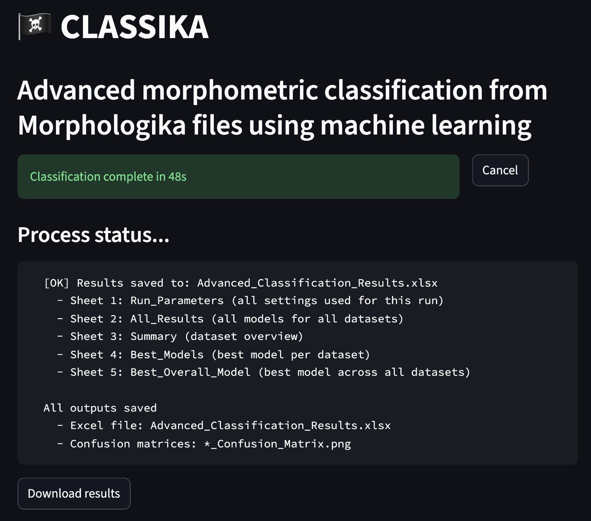

# 🏴‍☠️ CLASSIKA
Interactive morphometrics classification interface for Linux and Mac

## Requirements
- Python>=3.11
- Required packages (see **Download and run** section)
- MacOS:
  - OpenMP needs to be installed via the terminal. To install it, open your terminal app and run
```sh
brew install libomp
```

## Summary
Classika (*morphometric **classi**fication program for Morphologi**ka** files*) is a Streamlit-based local host app built around Sara Behnamian's ML framework for species classification from Morphologika data.

## Download and run
1. Ensure Python is installed on the system
2. Install the latest Classika release from GitHub
3. Unzip the install and open a terminal inside the folder
4. Create and activate viritual environment (recommended). The commands below should be run from the terminal, from the folder where 
```sh
python -m venv .venv
source .venv/bin/activate
```
5. Install requirements
```sh
pip install -r requirements_linux.txt
# OR
pip install -r requirements_mac.txt
```
6. Launch the app
```sh
streamlit run classika.py
```

## Usage

### Import data and set parameters

You are greeted by the data upload page when you launch Classika


    
Here, you can upload multiple Morphologika files and set some basic settings. Note that the "Number of data splits" option has a sizable impact on processing speed. Higher values will significantly slow down analysis.

The advanced settings dropdown exposes the parameters used by the model voting. These settings are best used by experienced users, but more novice users are presented with a button to completely disable the model voting.


    
Below the advanced settings, the user is presented by dropdown menus for each specific model. These may be left as they are if the user is less experienced in ML methods. All model-specific parameters are saved in the output for reproducibility.

When you are satisfied with the settings, click the "Classify" button at the bottom of the screen.

### Classification runs

After clicking "Classify," the app will show the elapsed time and the bottom 10 lines of the logging file.


    
Note that classification can take a long time. If the log under "Process status..." does not change, it does not necessarily mean that the process is stuck.

To get a general sense of how far along the analysis is, compare the current process status to the steps of the analysis. You can expect to see these headers appear in the process status viewer, in order

```
[FILTERING]
[TUNING]
[1] INDIVIDUAL MODELS
[2] STACKING ENSEMBLE
[3] WEIGHTED VOTING ENSEMBLE
[4] BLENDING ENSEMBLE
```

### Downloading results

When the analysis finishes, you will see the download screen


    
Click "Download results" to download a zip folder containing the outputs. When you unzip the file you downloaded, you will find the following files
```
results/
├── Advanced_Classification_Results.xlsx
├── input_filename_Confusion_Matrix_Best_Overall.png
├── misc/
└── run.log.txt
```

`run.log.txt` is identical to all the text that was streamed to the "Process status..." section. Here, you can find information about the rest of the files. In summary:
- `Advanced_Classification_Results.xlsx` contains the bulk of the results in multiple sheets
  - Sheet 1: Run_Parameters (all settings used for the run)
  - Sheet 2: All_Results (all models for all datasets)
  - Sheet 3: Summary (dataset overview)
  - Sheet 4: Best_Models (best model per dataset)
  - Sheet 5: Best_Overall_Model (best model across all datasets)
- `input_filename_Confusion_Matrix_Best_Overall.png` is a confusion matrix that shows the performance of the best model. You will see one confusion matrix per Morphologika file uploaded
- `misc/` is a folder that contains some advanced information, such as the weighted voting summary in `json` format and some automatically generated summary files that pertain to the catboost model

## Troubleshooting

### Data import fails

Classika requires plain text files in Morphologika format. If your input file does not contain the headers

```
[individuals]
[landmarks]
[dimensions]
[names]
[rawpoints]
```

Classika will not recognize the file as a Morphologika file

### Slow runs

Classification runs can take anywhere from under a minute to multiple hours or days. If analysis is running slow and you suspect the program is stuck, you can
- Click "Cancel"
- Under "General settings", set "Number of data splits" to 2. This is the lightest data partitioning setting and should allow for relatively quick runs (order of minutes) on single Morphologika files.

### Unexpected results

You might find you get unexpected results after a run. A potential culprit is incorrect partitioning of true classes in the data. A typical Morphologika file has a `[names]` section, where the classes in the data are laid out. It might look like

```
[names]
papio cynocephalus  66.491
...
papio cynocephalus  61.742
mandrillus leucophaeus 1959.1.2.6
...
mandrillus leucophaeus 48.444
Macaca mulatta f80.246
...
Macaca mulatta m10.10.19.5
```

Classika assumes that the groups are defined with binomial nomenclature, split by a space or an underscore (i.e. `Homo Sapiens`, `homo_sapiens`, `H. Sapiens`, etc.). If this is not the case, your data will not be grouped properly.

## Development notes

### Implementation of original script
We elected to call a modified version of Sara Behnamian's original script with `subprocess.Popen()` so that the program could be run similarly to how it was run by the author with minimal changes. Hardcoded variables were changed to commandline arguments. Lines that were removed from the original script are commented out in `src/classification.py` rather than deleted for clarity. A goal for the future is to clean up `src/classification.py` and provide a diff file to highlight the differences between the original classification script and the Classika-adapted script.

### Temporary directories
Files are copied over to a temporary directory and read from there since Streamlit cannot read files directly from the user's disk. The output files are also written to the same temporary directory, and the files are subsequently written to a zip archive to accommodate easy downloading. The temporary directory is always deleted.
